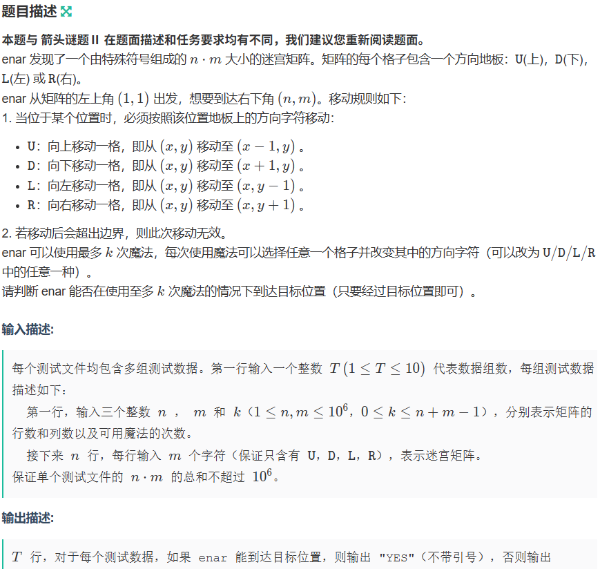
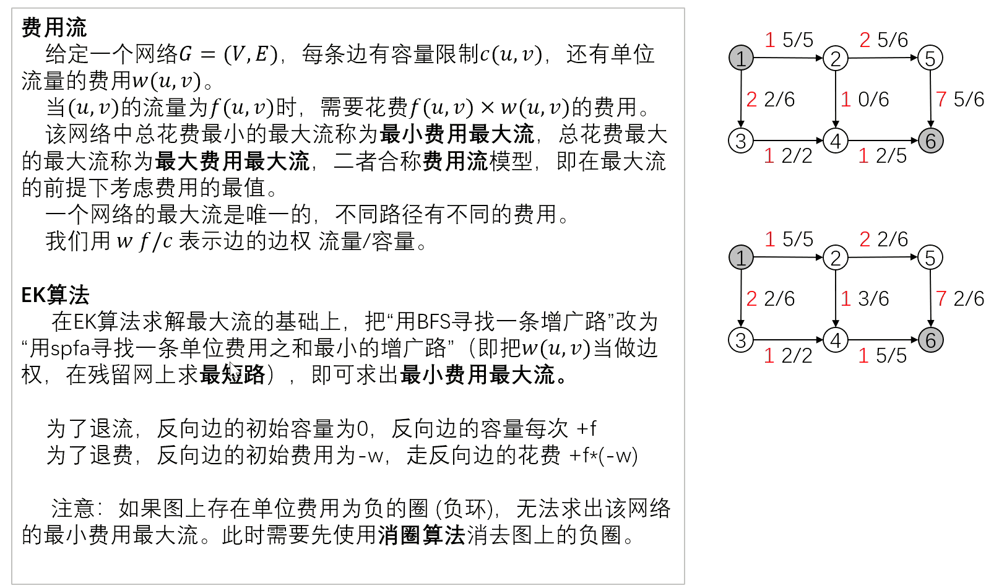
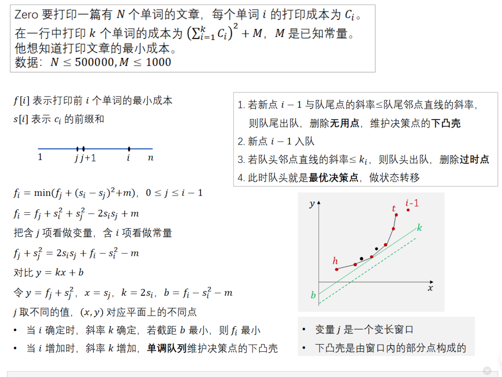
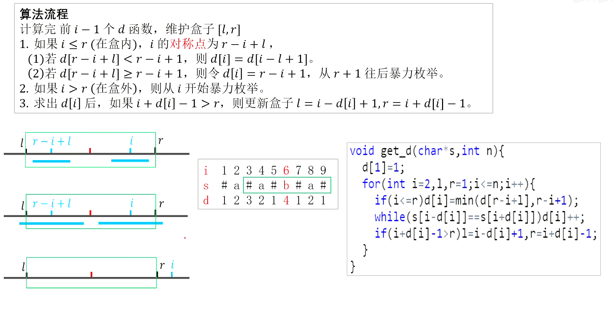
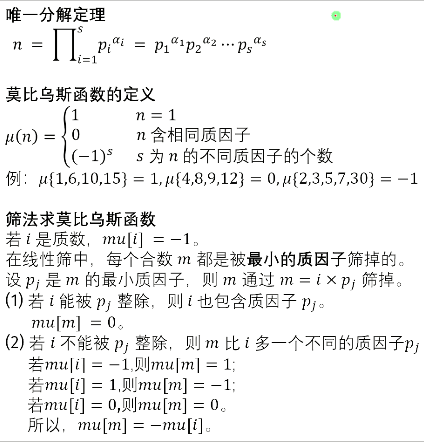
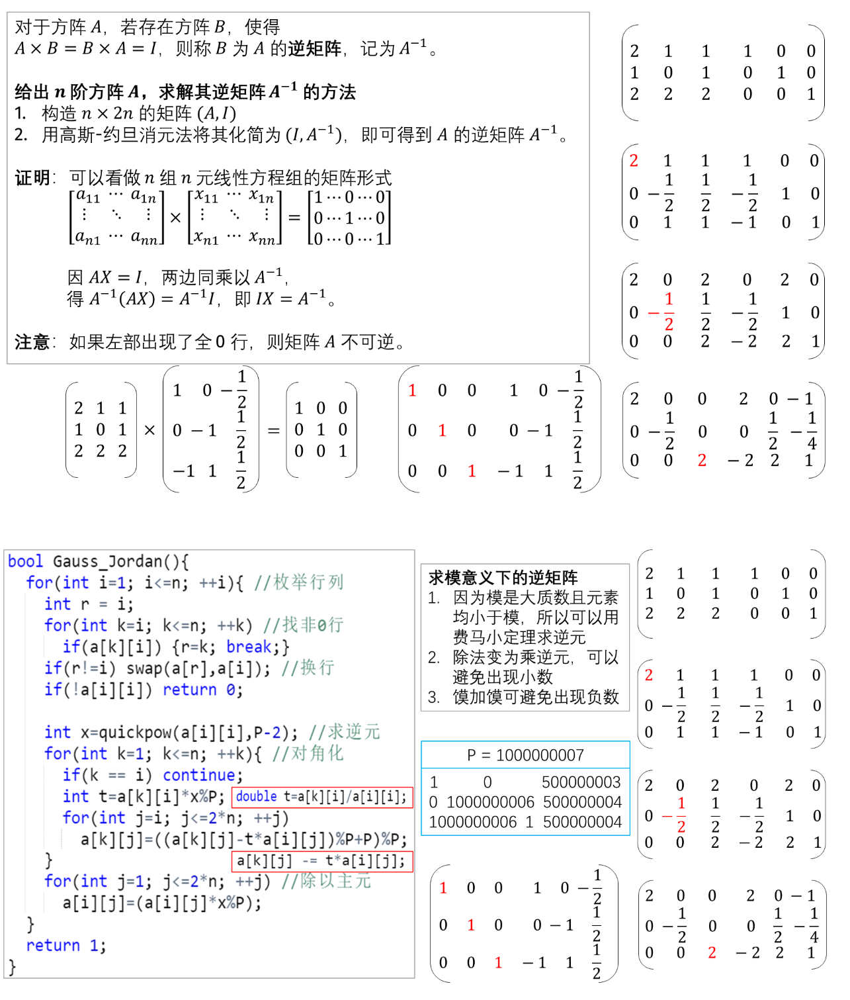
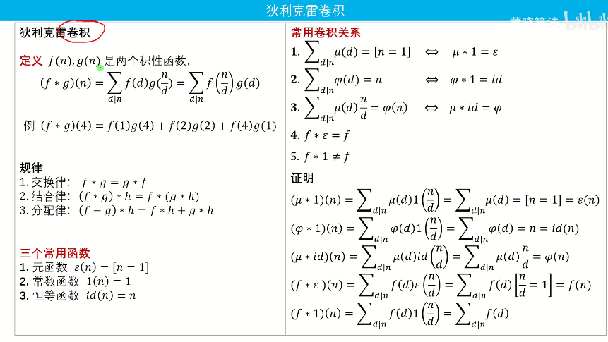
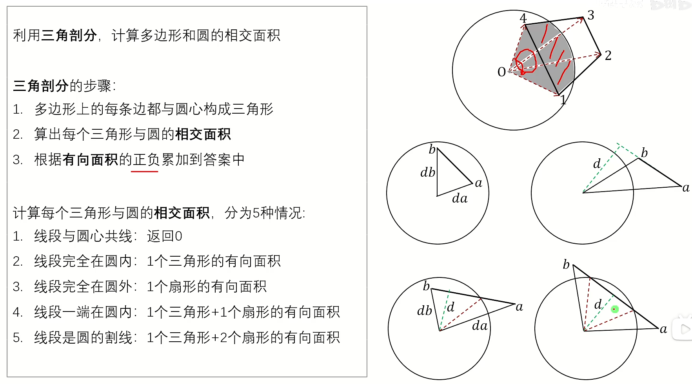
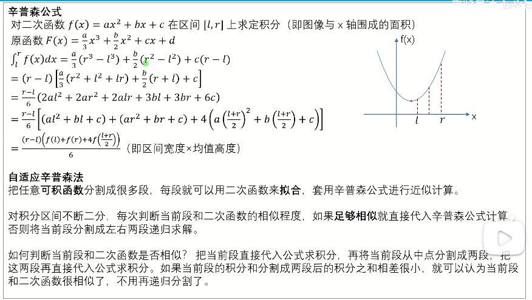
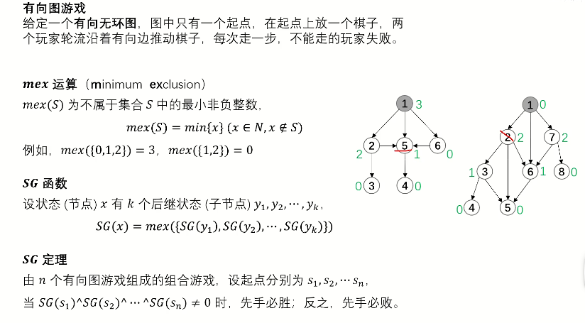

# EH的第二个板子，作为补充

[TOC]

## A 基础算法

### A43 单调栈

**题目描述**

给出项数为 $n$ 的整数数列 $a_{1 \dots n}$。

定义函数 $f(i)$ 代表数列中第 $i$ 个元素之后第一个大于 $a_i$ 的元素的**下标**，即 $f(i)=\min_{i<j\leq n, a_j > a_i} \{j\}$。若不存在，则 $f(i)=0$。

试求出 $f(1\dots n)$。

**输入格式**

第一行一个正整数 $n$。

第二行 $n$ 个正整数 $a_{1\dots n}$。

**输出格式**

一行 $n$ 个整数表示 $f(1), f(2), \dots, f(n)$ 的值。

输入 #1

```
5
1 4 2 3 5
```

输出 #1

```
2 5 4 5 0
```

对于 $100\%$ 的数据，$1 \le n\leq 3\times 10^6$，$1\leq a_i\leq 10^9$。

## B 搜索

### B30 01BFS

相当于可以节约一个log的，只有01路径的dij算法，使用deque而不是pri_que。

链接：https://ac.nowcoder.com/acm/contest/115184/D
来源：牛客网



输入

```
1
3 3 2
RLD
UDU
UUL
```

输出

```
YES
```

## C 数据结构

### C000 树状数组2

**题目描述**

如题，已知一个数列，你需要进行下面两种操作：

1. 将某区间每一个数加上 $x$；

2. 求出某一个数的值。

**输入格式**

第一行包含两个整数 $N$、$M$，分别表示该数列数字的个数和操作的总个数。

第二行包含 $N$ 个用空格分隔的整数，其中第 $i$ 个数字表示数列第 $i $ 项的初始值。

接下来 $M$ 行每行包含 $2$ 或 $4$ 个整数，表示一个操作，具体如下：

操作 $1$： 格式：`1 x y k` 含义：将区间 $[x,y]$ 内每个数加上 $k$；

操作 $2$： 格式：`2 x` 含义：输出第 $x$ 个数的值。

**输出格式**

输出包含若干行整数，即为所有操作 $2$ 的结果。

输入 #1

```
5 5
1 5 4 2 3
1 2 4 2
2 3
1 1 5 -1
1 3 5 7
2 4
```

输出 #1

```
6
10
```

对于 $100\%$ 的数据：$1 \leq N, M\le 500000$，$1 \leq x, y \leq n$，保证任意时刻序列中任意元素的绝对值都不大于 $2^{30}$。

## D 图论

### D3 SPFA算法

**题目描述**

给定一个 $n$ 个点的有向图，请求出图中是否存在**从顶点 $1$ 出发能到达**的负环。

负环的定义是：一条边权之和为负数的回路。

**输入格式**

输入的第一行是一个整数 $T$，表示测试数据的组数。对于每组数据的格式如下：

第一行有两个整数，分别表示图的点数 $n$ 和接下来给出边信息的条数 $m$。

接下来 $m$ 行，每行三个整数 $u, v, w$。

- 若 $w \geq 0$，则表示存在一条从 $u$ 至 $v$ 边权为 $w$ 的边，还存在一条从 $v$ 至 $u$ 边权为 $w$ 的边。
- 若 $w < 0$，则只表示存在一条从 $u$ 至 $v$ 边权为 $w$ 的边。

**输出格式**

对于每组数据，输出一行一个字符串，若所求负环存在，则输出 `YES`，否则输出 `NO`。

输入 #1

```
2
3 4
1 2 2
1 3 4
2 3 1
3 1 -3
3 3
1 2 3
2 3 4
3 1 -8
```

输出 #1

```
NO
YES
```

对于全部的测试点，保证：

- $1 \leq n \leq 2 \times 10^3$，$1 \leq m \leq 3 \times 10^3$。
- $1 \leq u, v \leq n$，$-10^4 \leq w \leq 10^4$。
- $1 \leq T \leq 10$。

### D18 Tarjan eDCC缩点

P8436 【模板】边双连通分量

**题目描述**

对于一个 $n$ 个节点 $m$ 条无向边的图，请输出其边双连通分量的个数，并且输出每个边双连通分量。

**输入格式**

第一行，两个整数 $n$ 和 $m$。

接下来 $m$ 行，每行两个整数 $u, v$，表示一条无向边。

**不保证图为简单图，图中可能有重边和自环。**

**输出格式**

第一行一个整数 $x$ 表示边双连通分量的个数。

接下来的 $x$ 行，每行第一个数 $a$ 表示该分量结点个数，然后 $a$ 个数，描述一个边双连通分量。

你可以以任意顺序输出边双连通分量与边双连通分量内的结点。

输入 #1

```
7 8
1 3
2 4
3 5
2 5
6 4
2 5
6 3
2 7
```

输出 #1

```
3
1 1
5 2 5 3 6 4
1 7
```

**样例1解释：**


相同颜色的点为同一个连通分量。

**数据范围：**
对于 $100\%$ 的数据，$1 \le n \le 5 \times10 ^5$，$1 \le m \le 2 \times 10^6$。

### D19 Tarjan vDCC缩点

P8435 【模板】点双连通分量

**题目描述**

对于一个 $n$ 个节点 $m$ 条无向边的图，请输出其点双连通分量的个数，并且输出每个点双连通分量。

**输入格式**

第一行，两个整数 $n$ 和 $m$。

接下来 $m$ 行，每行两个整数 $u, v$，表示一条无向边。

**输出格式**

第一行一个整数 $x$ 表示点双连通分量的个数。

接下来的 $x$ 行，每行第一个数 $a$ 表示该分量结点个数，然后 $a$ 个数，描述一个点双连通分量。

你可以以任意顺序输出点双连通分量与点双连通分量内的结点。

输入 #4

```
7 8
1 3
2 4
3 5
2 5
6 4
2 5
6 3
2 7
```

输出 #4

```
3
2 7 2
5 5 2 4 6 3
2 3 1
```

输入 #5

```
1 1
1 1
```

输出 #5

```
1
1 1
```

说明/提示

**样例四解释：**


相同颜色的点为同一个分量里的结点。

**温馨提示：请认真考虑孤立点与自环（样例五）的情况。**

------------
**数据范围：**
对于 $100\%$ 的数据，$1 \le n \le 5 \times10 ^5$，$1 \le m \le 2 \times 10^6$。

### D21 Dinic最大流

**题目描述**

如题，给出一个网络图，以及其源点和汇点，求出其网络最大流。

**输入格式**

第一行包含四个正整数 $n,m,s,t$，分别表示点的个数、有向边的个数、源点序号、汇点序号。

接下来 $m$ 行每行包含三个正整数 $u_i,v_i,w_i$，表示第 $i$ 条有向边从 $u_i$ 出发，到达 $v_i$，边权为 $w_i$（即该边最大流量为 $w_i$）。

**输出格式**

一行，包含一个正整数，即为该网络的最大流。

输入 #1

```
4 5 4 3
4 2 30
4 3 20
2 3 20
2 1 30
1 3 30
```

输出 #1

```
50
```

- 对于 $100\%$ 的数据，保证 $1 \leq n\leq200$，$1 \leq m\leq 5000$，$0 \leq w\lt 2^{31}$。

理论复杂度：$O(n^2m)$，实际挺快的

二分图上的Dinic更快。

### D23 最小费用最大流EK

**题目描述**

给出一个包含 $n$ 个点和 $m$ 条边的有向图（下面称其为网络） $G=(V,E)$，该网络上所有点分别编号为 $1 \sim n$，所有边分别编号为 $1\sim m$，其中该网络的源点为 $s$，汇点为 $t$，网络上的每条边 $(u,v)$ 都有一个流量限制 $w(u,v)$ 和单位流量的费用 $c(u,v)$。

你需要给每条边 $(u,v)$ 确定一个流量 $f(u,v)$，要求：

1.  $0 \leq f(u,v) \leq w(u,v)$（每条边的流量不超过其流量限制）；
2. $\forall p \in \{V \setminus \{s,t\}\}$，$\sum_{(i,p) \in E}f(i,p)=\sum_{(p,i)\in E}f(p,i)$（除了源点和汇点外，其他各点流入的流量和流出的流量相等）；
3. $\sum_{(s,i)\in E}f(s,i)=\sum_{(i,t)\in E}f(i,t)$（源点流出的流量等于汇点流入的流量）。

定义网络 $G$ 的流量 $F(G)=\sum_{(s,i)\in E}f(s,i)$，网络 $G$ 的费用 $C(G)=\sum_{(i,j)\in E} f(i,j) \times c(i,j)$。

你需要求出该网络的**最小费用最大流**，即在 $F(G)$ 最大的前提下，使 $C(G)$ 最小。

**输入格式**

输入第一行包含四个整数 $n,m,s,t$，分别代表该网络的点数 $n$，网络的边数 $m$，源点编号 $s$，汇点编号 $t$。

接下来 $m$ 行，每行四个整数 $u_i,v_i,w_i,c_i$，分别代表第 $i$ 条边的起点，终点，流量限制，单位流量费用。

**输出格式**

输出两个整数，分别为该网络的最大流 $F(G)$，以及在 $F(G)$ 最大的前提下，该网络的最小费用 $C(G)$。

输入 #1

```
4 5 4 3
4 2 30 2
4 3 20 3
2 3 20 1
2 1 30 9
1 3 40 5
```

输出 #1

```
50 280
```

对于 $100\%$ 的数据，$1 \leq n \leq 5\times 10^3$，$1 \leq m \leq 5 \times 10^4$，$1 \leq s,t \leq n$，$u_i \neq v_i$，$0 \leq w_i,c_i \leq 10^3$，且该网络的最大流和最小费用 $\leq 2^{31}-1$。



### D27 二分图最大匹配

**题目描述**

给定一个二分图，其左部点的个数为 $n$，右部点的个数为 $m$，边数为 $e$，求其最大匹配的边数。

左部点从 $1$ 至 $n$ 编号，右部点从 $1$ 至 $m$ 编号。

**输入格式**

输入的第一行是三个整数，分别代表 $n$，$m$ 和 $e$。

接下来 $e$ 行，每行两个整数 $u, v$，表示存在一条连接左部点 $u$ 和右部点 $v$ 的边。

**输出格式**

输出一行一个整数，代表二分图最大匹配的边数。

输入 #1

```
1 1 1
1 1
```

输出 #1

```
1
```

#### 数据规模与约定

对于全部的测试点，保证：
- $1 \leq n, m \leq 500$。
- $1 \leq e \leq 5 \times 10^4$。
- $1 \leq u \leq n$，$1 \leq v \leq m$。

### D99 Kruscal重构树

**题目描述**

给定一张 $N$ 个点的无向图，记为 $1\cdots N$ 。

图中有 $M$ 条边，第 $j$ 条边的长度为 $d_j$ 。

现在有 $K$ 个询问，每个询问的格式为 $A\ \  B$，表示询问从 $A$ 走到 $B$ 的所有路径中，最长边的最小值为多少。

**输入格式**

第一行为三个整数 $N, M, K$ 。

第二行到第 $M+1$ 行，每行三个整数 $X, Y, D$ ，表示从 $X$ 与 $Y$ 之间有一条长度为 $D$ 的边。

第 $M+2$ 行到第 $M+K+1$ 行，每行两个整数 $A, B$ ，意义如上。

**输出格式**

共 $K$ 行。

对于每个询问，输出最长边的最小值。

输入 #1

```
6 6 8
1 2 5
2 3 4
3 4 3
1 4 8
2 5 7
4 6 2
1 2
1 3
1 4
2 3
2 4
5 1
6 2
6 1
```

输出 #1

```
5
5
5
4
4
7
4
5
```

$1 \leq N \leq 15000$

$1 \leq M \leq 30000$

$1 \leq D_j \leq 10^9$

$1 \leq K \leq 15000$

## E 动态规划

### E43 单调队列优化dp

**题目描述**

在某两个城市之间有 $n$ 座烽火台，每个烽火台发出信号都有一定的代价。为了使情报准确传递，在连续 $m$ 个烽火台中至少要有一个发出信号。现在输入 $n,m$ 和每个烽火台的代价，请计算总共最少的代价在两城市之间来准确传递。

例如，有 5 个烽火台，他们发出信号的代价依次为 1,2,5,6,2，且 $m$ 为 3，则总共最少花费代价为 4，即由第 2 个和第 5 个烽火台发出信号。

**输入格式**

第一行是 $n,m$，表示 $n$ 个烽火台和连续烽火台数 $m$ ；

第二行 $n$ 个整数表示每个烽火台的代价 $a_i$ 。

**输出格式**

输出仅一个整数，表示最小代价。

输入 #1

```
5 3
1 2 5 6 2
```

输出 #1

```
4
```

**说明/提示**

对于全部数据，$1 \le n,m \le 2×{10}^5$ , $1 \le  a_i \le 1000$。

### E51 斜率优化DP



## F 字符串

### F5 马拉车-最长回文子串

**题目描述**

给出一个只由小写英文字符 $\texttt a,\texttt b,\texttt c,\ldots\texttt y,\texttt z$ 组成的字符串 $S$ ,求 $S$ 中最长回文串的长度 。

字符串长度为 $n$。

**输入格式**

一行小写英文字符 $\texttt a,\texttt b,\texttt c,\cdots,\texttt y,\texttt z$ 组成的字符串 $S$。

**输出格式**

一个整数表示答案。

输入输出样例 #1

输入 #1

```
aaa
```

输出 #1

```
3
```

$1\le n\le 1.1\times 10^7$。



## G 数学

### G12 莫比乌斯函数



没什么好说的，但是有一点要记住：

已知：
$$
g(d) = \sum_{k=1}^{\left\lfloor n/d \right\rfloor} f(kd)
$$

则根据莫比乌斯公式，有：
$$
f(x) = \sum_{k=1}^{\left\lfloor n/x \right\rfloor} \mu(k)\, g(kx)
$$
其中，$\mu(d)$ 为莫比乌斯函数：
$$
\mu(n)=
\begin{cases}
1, & n=1 \\
(-1)^k, & n=p_1p_2\cdots p_k \text{ 为互异素数的积}\\
0, & \text{否则}
\end{cases}
$$

### G24 矩阵求逆-高斯约旦消元法



时间复杂度：$O(n^3)$

### G37 迪利克雷卷积



### G51 三角剖分



个人感觉考的不多，就不写代码了，考到了的话，赛场上自己再写吧。

### G57 自适应辛普森积分



P4525 【模板】自适应辛普森法 1

**题目描述**

试计算积分

$\displaystyle{\int_L^R\frac{cx+d}{ax+b}\mathrm{d}x}$

结果保留至小数点后 $6$ 位。

数据保证计算过程中分母不为 $0$ 且积分能够收敛。

**输入格式**

一行，包含 $6$ 个实数 $a,b,c,d,L,R$。

**输出格式**

一行，积分值，保留至小数点后 $6$ 位。

输入 #1

```
1 2 3 4 5 6
```

输出 #1

```
2.732937
```

$a,b,c,d\in[-10,10]$，$-100\le L<R\le 100$ 且 $R-L\ge1$。

时间复杂度：${O(log(n / eps))}$

### G60 有向图博弈-SG函数



**题目描述**

给定一个有 N 个节点的有向无环图，图中某些节点上有棋子，两名玩家交替移动棋子。

玩家每一步可将任意一颗棋子沿一条有向边移动到另一个点，无法移动者输掉游戏。

对于给定的图和棋子初始位置，双方都会采取最优的行动，询问先手必胜还是先手必败。

**输入格式**

第一行，三个整数 N , M, K，N 表示图中节点总数，M 表示图中边的条数，K 表示棋子的个数。

接下来 M 行，每行两个整数 X, Y 表示有一条边从 X 出发指向 Y。

接下来一行，K 个空格间隔的整数，表示初始时，棋子所在的节点编号。

**输出格式**

若先手胜，输出 `win`，否则输出 `lose`。

### G74 拉格朗日插值法

P4781 【模板】拉格朗日插值

**题目描述**

对于 $n$ 个点 $(x_i,y_i)$，如果满足 $\forall i\neq j, x_i\neq x_j$，那么经过这 $n$ 个点可以唯一地确定一个 $n-1$ 次多项式 $y = f(x)$。

现在，给定这样 $n$ 个点，请你确定这个 $n-1$ 次多项式，并求出 $f(k) \bmod 998244353$ 的值。

**输入格式**

第一行两个整数 $n,k$。

接下来 $n$ 行，第 $i$ 行两个整数 $x_i,y_i$。

**输出格式**

一行一个整数，表示 $f(k) \bmod 998244353$ 的值。

输入 #1

```
3 100
1 4
2 9
3 16
```

输出 #1

```
10201
```

输入 #2

```
3 100
1 1
2 2
3 3
```

输出 #2

```
100
```

---

$1 \le n \leq 2\times 10^3$，$1 \le x_i,y_i,k < 998244353$，$x_i$ 两两不同。

时间复杂度：${O(n^2)}$

